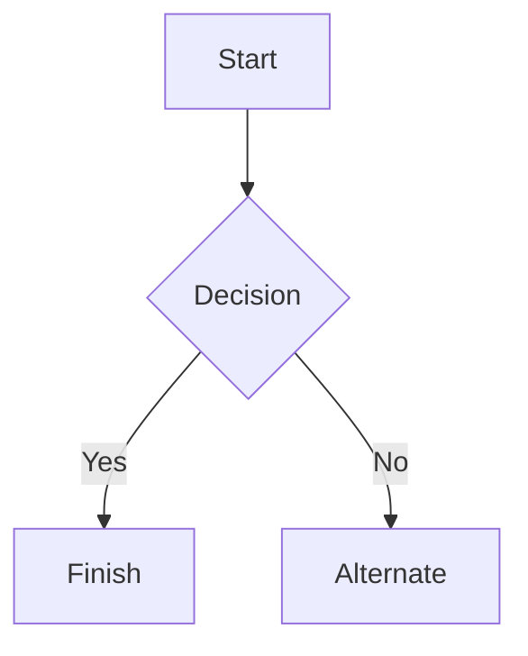

# Everything sample

## 1. Headers

# Heading h1
## Heading h2
### Heading h3
#### Heading h4
##### Heading h5
###### Heading h6

## 2. Emphasis

*italic with asterisks*
_italic with underscores_
**bold with asterisks**
__bold with underscores__
_You **can** combine them_
~~strikethrough text~~
**_bold italic together_**

## 3. Inline code

Run `go build ./...` then `docker compose up -d`.
Escaping inside code: `a \ b` and `` `ticks` ``.

## 4. Lists

### Unordered
* Item 1
* Item 2
  * Item 2a
  * Item 2b
    * Item 2b-i
* Item 3

### Ordered
1. Item 1
2. Item 2
3. Item 3
   1. Item 3a
   2. Item 3b

### Mixed nesting
1. First
   * bullet under number
   * another bullet
2. Second
   1. nested number

### Task list
- [x] completed task
- [ ] pending task
- [x] another done

### List item with continuation
* This item has a second paragraph.

  The paragraph stays aligned under the item.

### List item with a code block
* Install it:

  ```bash
  go install ./...
  ```

* Then run it.

## 5. Blockquotes

> Markdown is a lightweight markup language with plain-text-formatting syntax, created in 2004 by John Gruber with Aaron Swartz.

> Nested quotes get flattened:
>> Telegram has no nested blockquote entity.

> Quote containing a list:
> * first
> * second

## 6. Links

You may be using [Markdown Live Preview](https://markdownlivepreview.com/).
Bare URL: https://example.com/path?a=1&b=2
Link with tricky text: [a (b) c_d](https://example.com/x_y-z)

## 7. Images


Relative path stays as text: 

## 8. Tables

| Left columns  | Center        | Right columns |
| ------------- |:-------------:| -------------:|
| left foo      | mid foo       | right foo     |
| left bar      | mid bar       | right bar     |
| ünïcode ✓     | 日本語         | 123.45        |

## 9. Blocks of code

### Unfenced snippet (auto-detected)

let message = 'Hello world';
alert(message);

### Unfenced Go with a blank line

package main

func main() {
	fmt.Println("hi")
}

### Unfenced Python (indentation kept)

def main():
    if True:
        print("hi")

### Fenced with language

```js
const greet = (name) => {
  console.log(`Hello, ${name}`);
};
greet('Telegram');
```

```python
def main():
    print("hi")
```

```go
func main() {
	fmt.Println("hi")
}
```

```sql
SELECT id, name FROM users WHERE active = true;
```

### Fenced without language

```
plain fence
with `ticks` and \slash
```

### Indented code block

    indented line one
    indented line two

## 10. Horizontal rules

---

***

___

## 11. Escaping and punctuation

Cost: $5.00 (approx!) - done.
Special chars: _ * [ ] ( ) ~ > # + - = | { } . !
Math-ish: 2 * 3 = 6, a_b_c, 50% off.
Raw HTML: <b>bold tag</b> and <br/>
More HTML: <i>italic</i>, <u>underline</u>, <s>struck</s>, <code>a.b()</code>
HTML link: <a href="https://example.com/page">example</a>
Entities: a &amp; b, &lt;tag&gt;, &quot;quoted&quot;, &hellip;

## 12. Mermaid diagrams

### Fenced



### Unfenced

sequenceDiagram
Alice->>Bob: Hello Bob
Bob-->>Alice: Hi Alice

## 13. Unicode and emoji

Emoji: 🚀 ✅ 📎 中文 العربية
